8# Wisdom Hove — Project Portfolio

Microsoft Certified Azure Developer Associate with 6+ years of experience delivering enterprise-grade solutions using **Microsoft Power Platform**, **Dynamics 365**, and **Azure** services. Proven track record building scalable applications for international programs, including **Commonwealth** and **SADC** initiatives.

---

## Table of Contents
- [Professional Summary](#professional-summary)
- [Core Skills & Technologies](#core-skills--technologies)
- [Project Experience](#project-experience)
  - [1) Commonwealth GBV & Sexual Reproductive Health Response System](#1-commonwealth-gbv--sexual-reproductive-health-response-system)
  - [2) SADC HIV Monitoring & Evaluation Data Collection System](#2-sadc-hiv-monitoring--evaluation-data-collection-system)
  - [3) Smart Crop Management Suite](#3-smart-crop-management-suite)
- [Education](#education)
- [Certifications](#certifications)
- [Screenshots / Evidence](#screenshots--evidence)
- [Contact](#contact)

---

## Professional Summary

Microsoft Certified **Azure Developer Associate** with over **6 years** of experience delivering enterprise-grade solutions using **Microsoft Power Platform**, **Dynamics 365**, and **Azure services**. Experienced in end-to-end solution delivery—from design and development to deployment and ongoing support—while ensuring secure, efficient, and user-focused systems.

**Specialises in:**
- Power Apps (Canvas & Model-Driven)
- Power Automate
- Power BI
- Dataverse
- Cloud-based integrations using Azure Functions and APIs

---

## Core Skills & Technologies

### Microsoft Stack
- Power Apps (Canvas & Model-Driven)
- Power Automate & Azure Logic Apps
- Power BI (Dashboards & Reporting)
- Dynamics 365 & Dataverse
- SharePoint Online & Microsoft Teams

### Development
- C# .NET
- JavaScript / React
- REST APIs & Azure Integrations

### Cloud & DevOps
- Azure Functions & event-driven architecture
- Azure DevOps & Git
- Secure solution design & ALM practices

### Other Strengths
- Solution architecture & system design
- End-to-end project delivery
- Client engagement & requirements analysis
- Mentoring developers and stakeholders

---

## Project Experience

### 1) Commonwealth GBV & Sexual Reproductive Health Response System

**Role:** Power Platform Developer  
**Duration:** October 2023 – Present

**Overview**  
Development of a multi-country digital platform supporting **Gender-Based Violence (GBV)** and **Sexual Reproductive Health (SRHR)** programs across the Commonwealth.

**Technologies**
- Power Apps (Canvas & Model-Driven)
- Power Automate
- Power BI
- Dynamics 365 / Dataverse
- SharePoint Online
- Microsoft Teams (permissions / collaboration)
- Azure APIs
- .NET

**Key Contributions**
- Built Power Apps (Canvas & Model-Driven) for case management and structured data capture
- Developed Power Automate workflows to streamline processes and automate notifications
- Designed Dataverse tables and data models to support reporting and operations
- Created Power BI dashboards for reporting and insights
- Built and managed SharePoint sites, lists, and document libraries
- Managed Microsoft Teams & SharePoint permissions
- Integrated systems using Azure APIs and .NET services

**Impact**
- Enabled near real-time reporting across multiple regions
- Improved operational efficiency through automation
- Enhanced visibility for decision-makers via dashboards and structured reporting

**Evidence**

**Sample App**
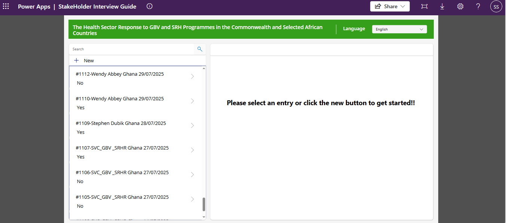
**Sample App**
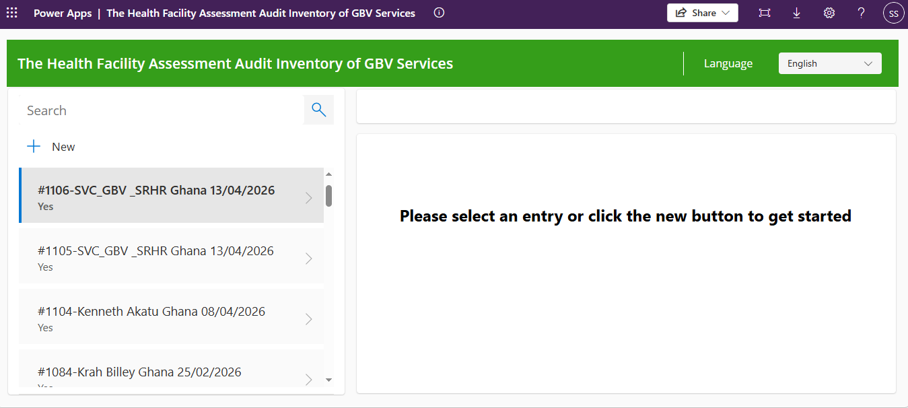
**Sample App**
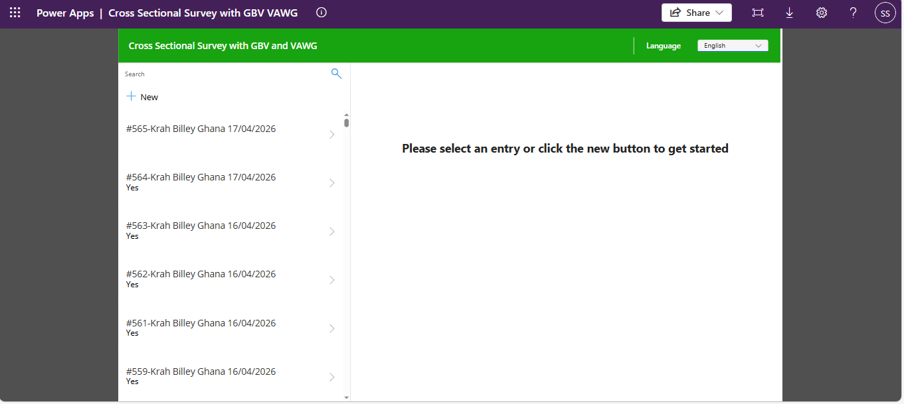
**Sample Dashboard**
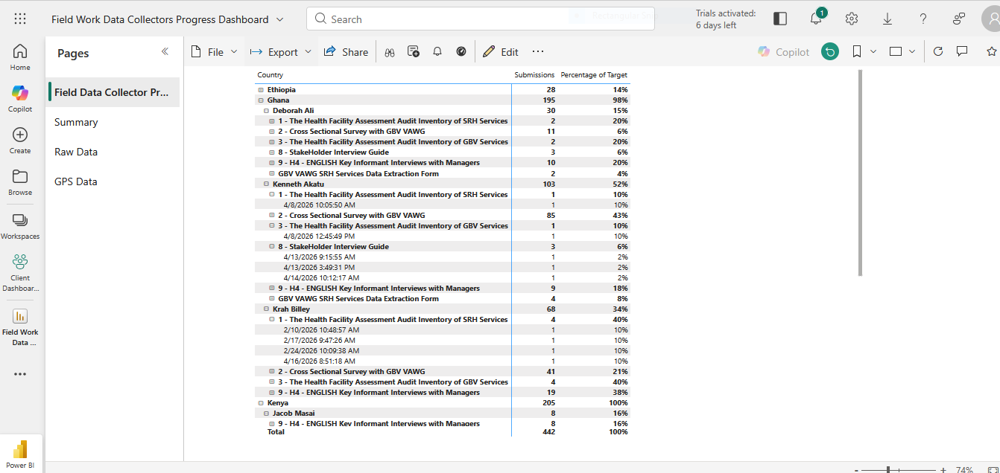
**Sample Dashboard**
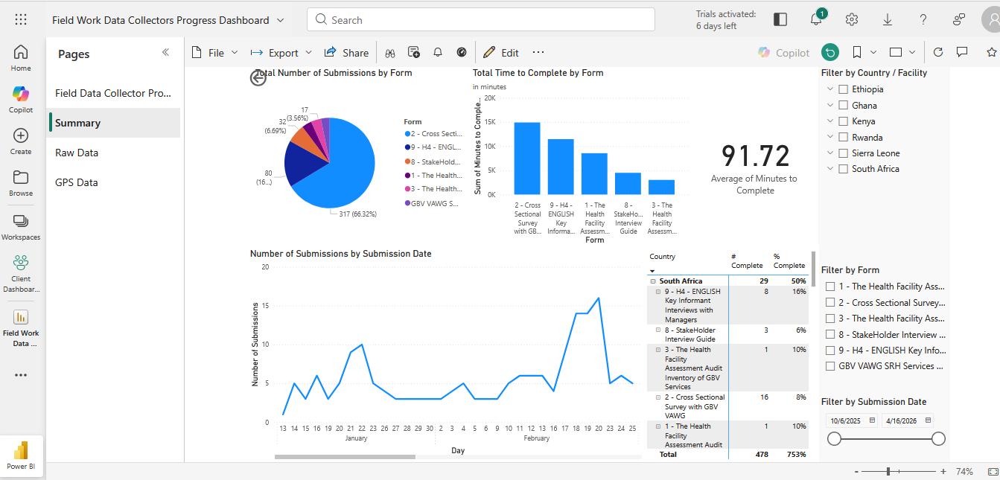
**Sample Dashboard**
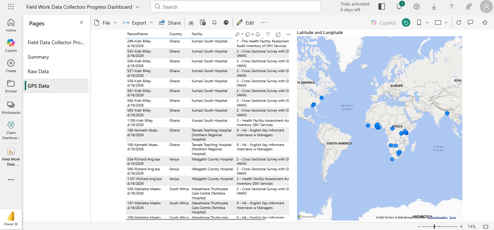
**Sample Dashboard**
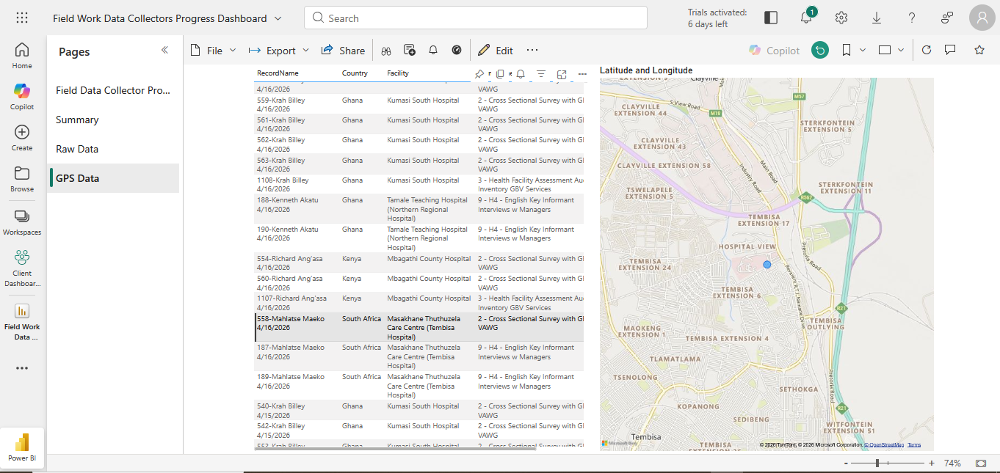
**SharePoint List**
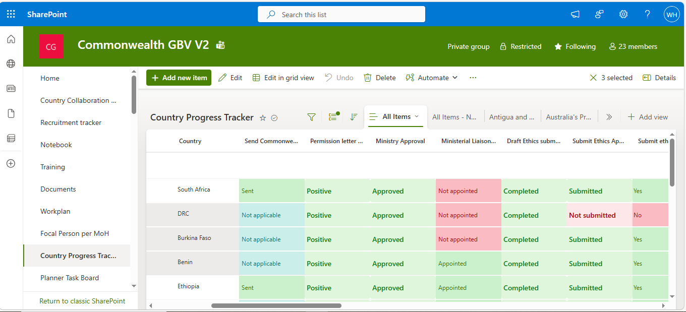
**SharePoint List**

**Sample Workflow**
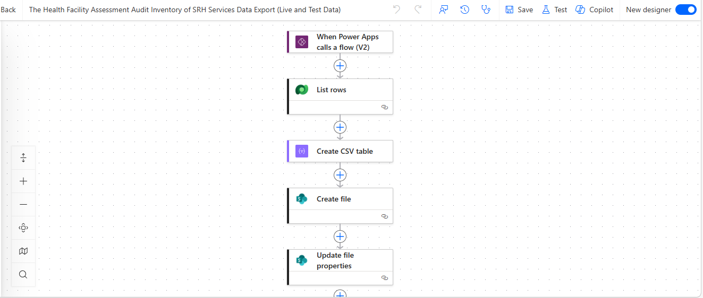
**Sample Workflow**
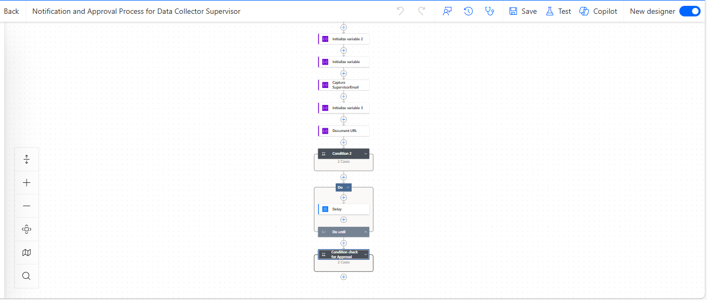

---

### 2) SADC HIV Monitoring & Evaluation Data Collection System

**Role:** Power Platform Developer

**Overview**  
Regional system supporting HIV monitoring and evaluation across SADC member states.

**Technologies**
- Power Platform
- Azure Services
- Dataverse
- Power BI

**Key Contributions**
- Contributed to data collection and reporting features
- Supported workflow automation and system enhancements
- Assisted in building scalable data solutions for regional use

**Impact**
- Strengthened regional health data reporting
- Supported evidence-based decision-making

**Evidence**
- Project details available on request *(confidential system — no public assets)*

---

### 3) Smart Crop Management Suite

**Role:** Power Platform Developer

**Overview**  
End-to-end development of a digital solution for managing agricultural operations and improving crop productivity.

**Technologies**
- .NET
- Power Platform
- Dataverse
- Azure Services

**Key Contributions**
- Led full lifecycle development (design → build → deployment)
- Designed system architecture and implemented core features
- Deployed solution to client environments
- Provided ongoing support, maintenance, and enhancements
- Worked directly with clients to refine requirements and prioritize features

**Impact**
- Delivered a complete, production-ready solution
- Improved efficiency and data visibility in farming operations
- Demonstrated ownership of the full product lifecycle

**Evidence**

**Sample App**
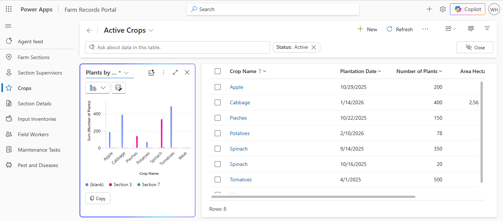
**Sample App**
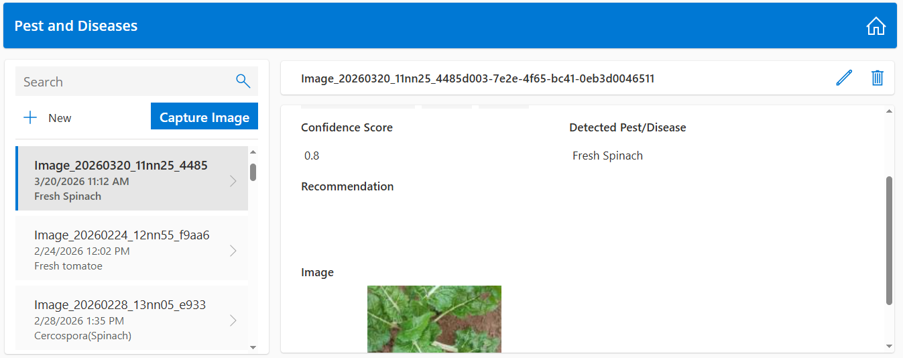

---

## Education

**National Diploma in Information Technology (NQF Level 6)**  
Bulawayo Polytechnic College  
**Graduated:** 2010

---

## Certifications
- Microsoft Certified: **Azure Developer Associate** (2022 — Renewal **Sept 2026**)
- Microsoft Certified: **Power Platform Fundamentals** (2022)
- Microsoft Certified: **Azure Data Fundamentals** (2022)
- Microsoft Certified: **Azure Fundamentals** (2022)
  
---

## Contact

- **Name:** Wisdom Hove  
- **GitHub:** @HoveWisdom
- **LinkedIn:**(https://www.linkedin.com/in/wisdom-hove-a7438655/)  

